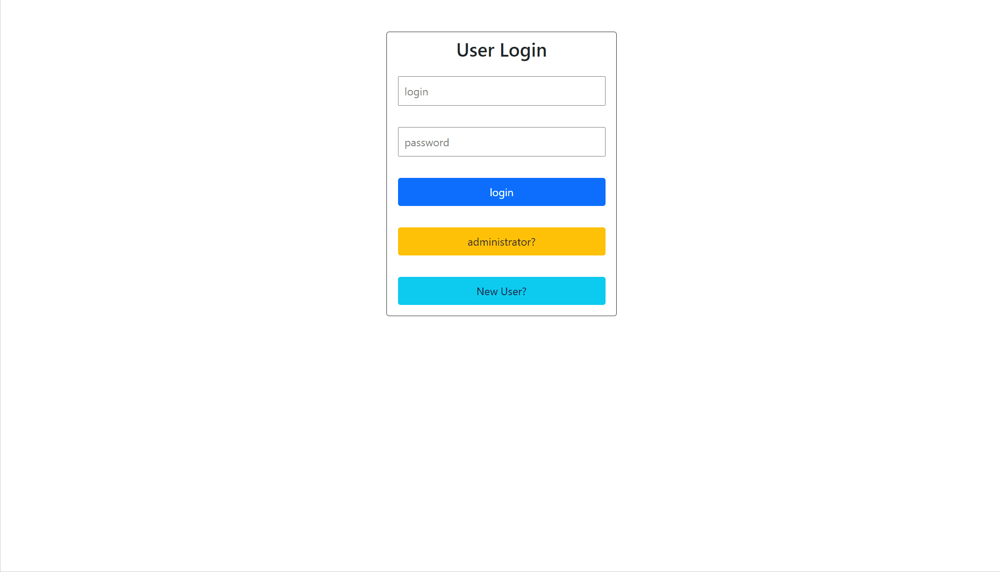

# README

Notice Board

 
    <a href="#sobre">Sobre</a>
    <a href="#funcionalidades">Funcionalidades</a>
    <a href="#tecnologias">Tecnologias</a>
    <a href="#Autor">Autor</a>
 

 # Sobre
 

 
mural de avisos, com sistema de login, salvando os posts do administrador dentro do banco de dados do Mongo. criado com node.js

 
O site está 100% em inglês para treinar o meu desenvolvimento com projetos em inglês

 # Funcionalidades 
<ul>
    <li>Criar conta</li>
    <li>Entrar na conta</li>
    <li>Acessar post salva no banco de dados</li>
    <li>Criar post</li>
    <li>Deletar post</li>
    <li>Editar post</li>
 </ul>

 # Tecnologias
 <ul>
    <li>HTML</li>
    <li>CSS</li>
    <li>Javascript</li>
    <li>Mongo</li>        
    <li>Node.js</li>
    <li>Bootstrap</li>
 </ul>

 # Autor

 <ul>
    <li>Yutaro Negi</li>
    <li><a href="https://www.linkedin.com/in/yutaronegi/">Linkedin</a></li>
    <li>(11) 94194-5061</li>
    <li>souza_yutaro@hotmail.com</li>
 </ul>

